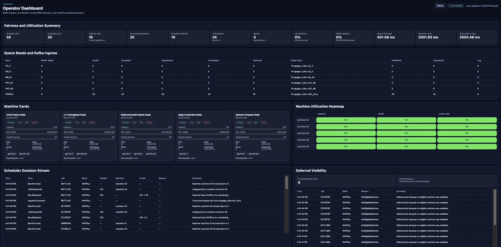
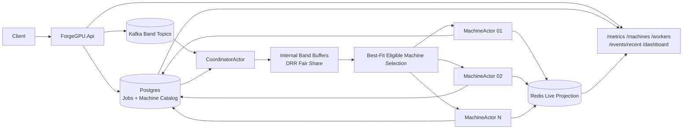
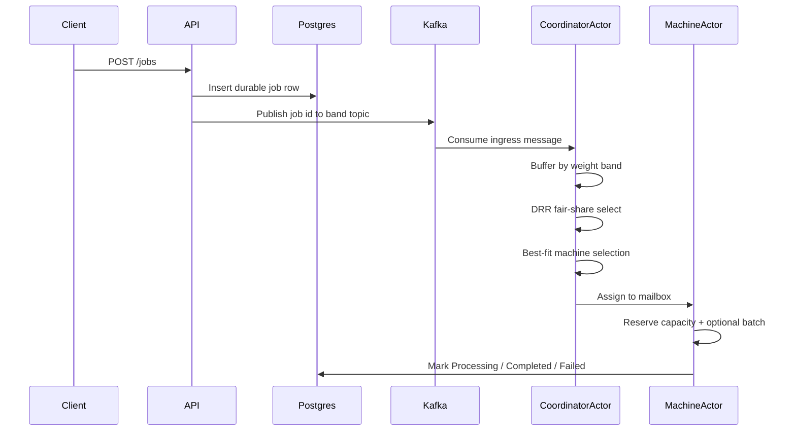
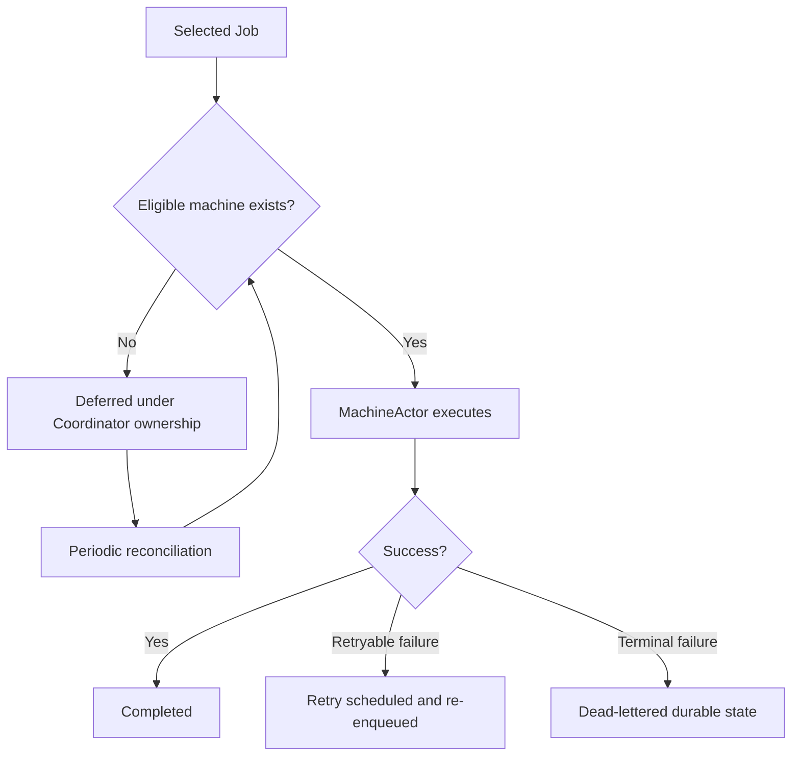
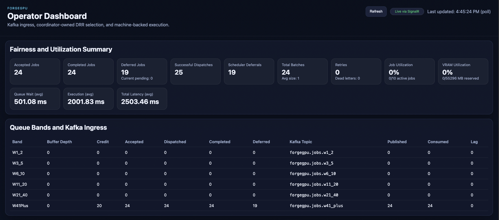
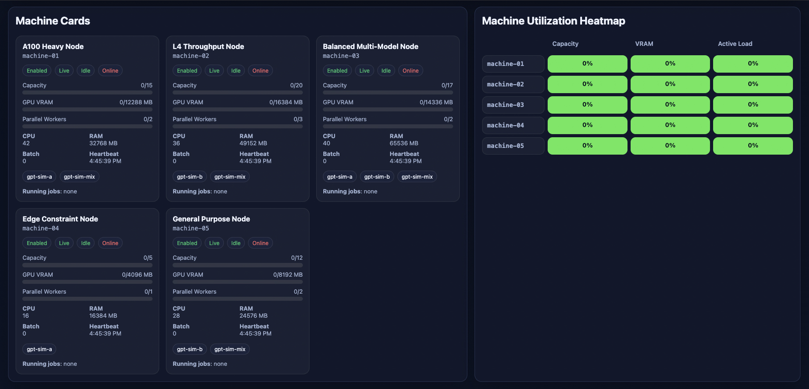
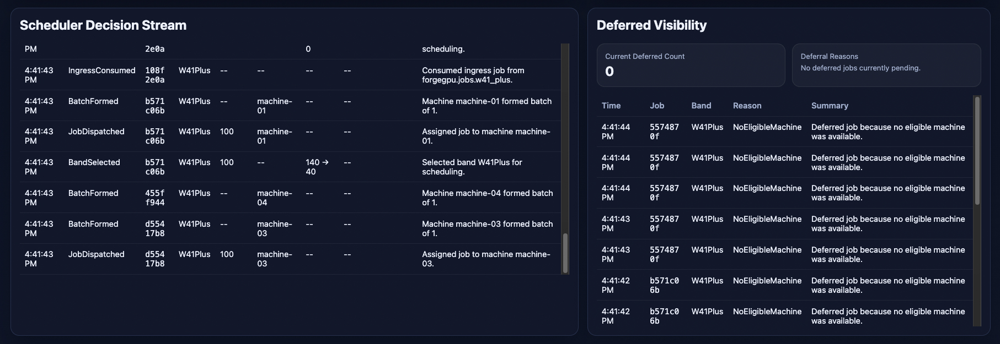

# ForgeGPU

ForgeGPU is an AI inference orchestration demo built in .NET 10. It models the control plane of an inference platform: jobs are durably recorded in Postgres, published to Kafka band topics, selected by a coordinator with fair-share logic, assigned to eligible machines using resource-aware best-fit placement, executed by actor-owned machine workers, and exposed through live metrics, a real-time operator dashboard with polling fallback, and repeatable load scenarios.

**The language is .NET. The problems are not.** Scheduling under resource constraints, fair-share selection, actor-oriented ownership, durable truth versus live projection separation — these are infrastructure problems independent of runtime. The codebase is small enough to read in full and large enough to discuss real control-plane tradeoffs.



## Why This Project Is Interesting

ForgeGPU targets the class of engineering problems that arise in inference infrastructure, not generic background-job processing.

It demonstrates:
- inference request routing and workload orchestration
- GPU workload scheduling under simulated resource constraints (capacity units, VRAM, model compatibility)
- fair-share scheduling with exact-weight debit to prevent starvation across traffic classes
- resource-aware best-fit placement to reduce fragmentation and preserve capacity for heavy workloads
- actor-oriented control-plane ownership with explicit state boundaries
- durable truth versus live projection separation
- batching, retry, timeout, and dead-letter behavior
- operational visibility through metrics, machine state, recent events, and a live dashboard
- reproducible load scenarios with `k6`

The design choices are explicit and inspectable. That makes the codebase useful in engineering conversations about inference platform architecture.

## Why .NET Instead of Python or Rust

The inference platform problems this project explores — scheduling fairness, placement logic, actor-model ownership, durable state separation — are language-independent. .NET 10 with its async runtime, actor mailbox model, and low-allocation primitives is a legitimate platform for building distributed infrastructure.

The implementation choices worth discussing are:
- how DRR fair-share interacts with exact-weight debit
- why Kafka is ingress transport and not the scheduler
- why machine actors own live resource state instead of a shared store
- why durable truth and live projection are separated

These are the same questions that matter in Python or Rust inference platforms. The language is a detail. The control-plane reasoning is not.

## Current Implementation

Current implemented capabilities:
- durable job state in Postgres
- Kafka-aligned ingress topics by coarse weight band
- `CoordinatorActor` as the scheduling brain
- `MachineActor` as the execution and resource owner
- internal band buffers with DRR-style fair-share scheduling
- exact-weight debit preserved for scheduling decisions
- resource-aware best-fit eligible machine selection
- durable machine catalog in Postgres
- live machine projection in Redis
- heartbeat and liveness handling
- batching, retry, timeout, and dead-letter behavior
- `/metrics`, `/machines`, `/workers`, `/events/recent`
- built-in operator dashboard at `/dashboard/`
- `k6` load scenarios and operational scripting

## Current State vs Target Direction

| Area | Current implementation | Target direction |
| --- | --- | --- |
| Ingress transport | Kafka band topics | Same model with richer fairness controls and visualization |
| Durable truth | Postgres for jobs and machine catalog | Postgres remains durable source of truth |
| Live projection | Redis machine projection | Same projection model with richer operator views |
| Scheduling | DRR-style fair-share across internal band buffers | Continued fairness tuning and stronger operator explanation |
| Placement | Resource-aware best-fit eligible machine | Same placement model with future refinement |
| Execution ownership | MachineActor owns live resource and execution state | Same actor-oriented ownership model |
| Reliability | Retry, timeout, dead-letter implemented | More polish, not a redesign |
| Dashboard | Lightweight built-in operator dashboard | Further polish and storytelling |

## Core Design Ideas

- Postgres holds durable truth.
- Redis holds live projections.
- Kafka is ingress transport only.
- `CoordinatorActor` sits between ingress and execution.
- `MachineActor` owns resource reservations and execution state.
- ForgeGPU uses coarse resource bands for ingress grouping and exact weight for scheduling decisions.
- Exact weight is never discarded even when jobs are grouped into coarse ingress bands.
- Best-fit machine selection reduces fragmentation and preserves larger machines for heavier work.

## State Ownership and Data Boundaries

| Layer | Responsibility | Why it exists |
| --- | --- | --- |
| Postgres | Durable truth for jobs, machine catalog, retry metadata, and dead-letter state | Durable inspection, replay-safe reasoning, and consistent API reads |
| Kafka | Ingress transport segmented by coarse weight band | Clean ingress lanes without turning the broker into the scheduler |
| CoordinatorActor | Scheduling brain | Owns band buffering, DRR-style selection, deferred re-evaluation, and machine assignment |
| MachineActor | Live execution and resource ownership | Owns reservations, batching, running jobs, and machine-local state |
| Redis | Live projection only | Fast operator visibility for machines and current runtime state |
| Dashboard + APIs | Read-only operator view | Makes the control plane explainable during demos and load runs |

A useful mental model:
- Postgres answers **what is durably true**.
- Kafka answers **what has arrived for ingress**.
- CoordinatorActor answers **what should run next**.
- MachineActor answers **what is running right now**.
- Redis answers **what the live system currently looks like**.

## Architecture Overview



What matters here:
- Kafka does not schedule work.
- The coordinator schedules work.
- Machines do not consume ingress directly.
- Machine actors own live execution state.

## Control Flow

### Normal path



### Deferred and reliability path



## CoordinatorActor vs MachineActor

### CoordinatorActor

Responsibilities:
- consume Kafka ingress
- classify jobs into internal band buffers
- apply DRR-style fair-share selection
- inspect machine liveness and capacity
- choose the best-fit eligible machine
- own deferred-job re-evaluation

### MachineActor

Responsibilities:
- own live machine state
- reserve and release capacity units
- reserve and release simulated VRAM
- own running jobs and mailbox execution
- form compatible batches
- update durable job state
- publish heartbeat and live projection

This ownership model keeps the system explainable. There is one place for global scheduling and one place per machine for live execution state.

## Machine and Resource Model

ForgeGPU uses fake heterogeneous machines to make scheduling decisions understandable.

A capacity unit is a simulated abstract scheduling budget. It is not real GPU telemetry. It exists so scheduling and fragmentation are explainable without requiring real hardware.

| Machine | Capacity Units | CPU Score | RAM MB | GPU VRAM MB | Max Parallel Workers | Supported Models |
| --- | ---: | ---: | ---: | ---: | ---: | --- |
| `machine-01` A100 Heavy Node | 15 | 42 | 32768 | 12288 | 2 | `gpt-sim-a`, `gpt-sim-mix` |
| `machine-02` L4 Throughput Node | 20 | 36 | 49152 | 16384 | 3 | `gpt-sim-b`, `gpt-sim-mix` |
| `machine-03` Balanced Multi-Model Node | 17 | 40 | 65536 | 14336 | 2 | `gpt-sim-a`, `gpt-sim-b`, `gpt-sim-mix` |
| `machine-04` Edge Constraint Node | 5 | 16 | 16384 | 4096 | 1 | `gpt-sim-a` |
| `machine-05` General Purpose Node | 12 | 28 | 24576 | 8192 | 2 | `gpt-sim-b`, `gpt-sim-mix` |

The heterogeneity matters: different machines have different VRAM budgets, model compatibility sets, and parallel worker limits. The scheduler must reason about all of these simultaneously, which is the same constraint class as real GPU fleet scheduling.

Example intuition: a 17-unit machine may receive `10w + 5w + 1w + 1w` instead of draining only tiny jobs or only medium jobs, to balance fairness and resource utilization.

## Job Model

Each job stores:
- `prompt`
- `model`
- `weight`
- `weightBand`
- `requiredMemoryMb`
- `status`
- retry metadata
- failure metadata
- timestamps for queue wait, execution, and total latency

Important distinctions:
- exact weight is authoritative
- `weightBand` is derived
- `requiredMemoryMb` is a resource hint for placement
- retry/failure fields keep execution inspectable

## Weight Bands and Exact Weight

**ForgeGPU uses coarse resource bands for ingress grouping and exact weight for scheduling decisions.**

Ingress bands:
- `W1_2` -> `forgegpu.jobs.w1_2`
- `W3_5` -> `forgegpu.jobs.w3_5`
- `W6_10` -> `forgegpu.jobs.w6_10`
- `W11_20` -> `forgegpu.jobs.w11_20`
- `W21_40` -> `forgegpu.jobs.w21_40`
- `W41Plus` -> `forgegpu.jobs.w41_plus`

| Band | Range | Purpose |
| --- | --- | --- |
| `W1_2` | `1-2` | keep tiny jobs granular |
| `W3_5` | `3-5` | separate small jobs from trivial ones |
| `W6_10` | `6-10` | represent moderate work cleanly |
| `W11_20` | `11-20` | prevent medium-heavy work from starvation |
| `W21_40` | `21-40` | make large work visible in fairness logic |
| `W41Plus` | `41+` | avoid one-topic-per-weight explosion for heavy jobs |

Why this matters:
- bands keep ingress understandable
- exact weight still drives DRR debit
- exact weight still drives resource estimation and placement
- Kafka lanes align with the taxonomy, but Kafka itself is not the scheduling layer

## Scheduling Algorithms

### Deficit Round Robin

The coordinator maintains internal band buffers and applies a DRR-style fair-share loop.

Behavior:
- each band accumulates credit
- selecting a job spends credit using the job's exact weight
- heavier jobs still get a path to selection
- fairness is applied before machine placement

This is a direct analogue of the scheduling fairness problem in multi-tenant inference platforms: how do you prevent a flood of small fast requests from starving large expensive ones?

### Best-Fit Eligible Machine

After DRR selects a job, ForgeGPU filters eligible machines by capacity, VRAM, and model compatibility, then chooses the one that leaves the smallest non-negative remaining capacity after placement.

That reduces fragmentation and preserves larger machines for heavier work — the same fragmentation concern that matters in GPU fleet management.

## What "17w" Means in Practice

A machine capacity such as `17` is not a promise of "17 jobs per hour" or a literal hardware unit. It is a simulated abstract budget used to make placement explainable.

| Example mix | Total | Why it is useful |
| --- | ---: | --- |
| `10w + 5w + 1w + 1w` | 17 | Good balanced fit with minimal leftover capacity |
| `5w + 5w + 5w + 1w + 1w` | 17 | Medium-heavy mix still fits without wasting capacity |
| `17 x 1w` | 17 | Possible, but often not ideal if heavier work is waiting |
| `20w` | not eligible | Exceeds the machine's abstract capacity budget |

The system balances two goals simultaneously:
1. fairness for incoming work across traffic classes
2. efficient use of heterogeneous machine capacity

## Batching, Reliability, and Observability

### Batching
- worker-side batching only
- compatible jobs share model and fit resource limits
- each job still keeps independent durable lifecycle state

### Reliability
- timeout handling
- retryable versus terminal failure classification
- capped retry policy
- dead-lettered durable state for terminal failures

### Observability
- `GET /metrics`
- `GET /machines`
- `GET /workers`
- `GET /events/recent`
- `GET /jobs/{id}`
- `GET /jobs/dead-letter`
- operator dashboard at `/dashboard/`

Observability is not bolted on. The design exposes scheduler decisions, machine state, deferral reasons, and per-job lifecycle in real time. That is the same requirement as operating an inference fleet under production load.

## Operator Dashboard

Route:
- `http://localhost:8080/dashboard/`

The dashboard is a read-only operator view over the live orchestration system. It uses SignalR for live push updates where available and retains the existing polling path as a fallback.

Sections:
- queue bands and Kafka ingress
- machine cards
- scheduler decision stream
- fairness and utilization summary
- machine utilization heatmap
- deferred-job visibility

It is intentionally lightweight: HTML, CSS, JS, and a small SignalR hub served by the existing ASP.NET host.

The dashboard is designed to be kept open during load runs so you can watch the orchestrator react in real time while `k6` or manual traffic is exercising the system.

Top-level summary and ingress view:
- fairness and utilization summary
- queue-band depth, Kafka topic counters, and lag visibility



Machine capacity and utilization view:
- machine cards with durable metadata plus live state
- utilization heatmap for capacity, VRAM, and active load



Decision and fallback visibility:
- recent scheduler decisions
- deferred-job stream and deferral reasons



## Benchmark and Behavior Summary

ForgeGPU includes `k6` scenarios that demonstrate system behavior rather than synthetic benchmark marketing.

What the project currently demonstrates under load:
- concurrent job ingestion through Kafka band topics
- fair-share selection across weight bands
- batching under compatible traffic
- deferred behavior under constrained capacity
- retry and dead-letter behavior under induced failures
- machine utilization and scheduler visibility through metrics and dashboard views

Included scenarios:
- `basic`
- `batch`
- `constrained`
- `reliability`

## Testing

ForgeGPU includes both unit tests and integration tests.

Coverage focus:
- weight-band classification boundaries
- resource estimation
- best-fit eligible machine selection
- DRR-style fair-share behavior
- retry / timeout / dead-letter policy behavior
- main HTTP flows for jobs, metrics, machines, events, and dashboard route smoke

Run tests:

```bash
./scripts/forgegpu.sh test unit
./scripts/forgegpu.sh test integration
./scripts/forgegpu.sh test all
```

Notes:
- unit tests are fast and do not require the full runtime stack
- integration tests start their own test dependencies and exercise real HTTP behavior
- prompt markers such as `fail-retry-once`, `slow-timeout`, and `fail-always` are used intentionally in tests to keep failure scenarios explicit and reproducible

## Watching Load in Real Time

The intended demo flow is to keep the dashboard open while a load scenario is running.

Recommended local flow:

```bash
./scripts/forgegpu.sh up --build --detach
./scripts/forgegpu.sh dashboard
./scripts/forgegpu.sh load batch --vus 6 --iterations 24
```

While the load test is running, the dashboard lets you watch:
- queue-band depth change over time
- Kafka ingress and consumption movement
- DRR credit movement across bands
- machine utilization and VRAM reservation changes
- batch formation events
- deferred / retry / dead-letter events

Because the dashboard uses SignalR when available and polling as fallback, it is suitable for parallel operator observation during `k6` runs.

## How to Demo ForgeGPU

Start the stack:

```bash
cp .env.example .env
./scripts/forgegpu.sh up --build --detach
./scripts/forgegpu.sh health
./scripts/forgegpu.sh topics
./scripts/forgegpu.sh dashboard
```

Open the dashboard:

```bash
open http://localhost:8080/dashboard/
```

The dashboard will subscribe to live updates automatically. If SignalR is unavailable, it continues refreshing through the existing HTTP polling path.

Submit mixed-band jobs:

```bash
for w in 2 5 10 20 40 41; do
  curl -s -X POST http://localhost:8080/jobs \
    -H "Content-Type: application/json" \
    -d "{\"prompt\":\"demo-$w\",\"model\":\"gpt-sim-a\",\"requiredMemoryMb\":2048,\"weight\":$w}"
done
```

Trigger a deferred case:

```bash
curl -s -X POST http://localhost:8080/jobs \
  -H "Content-Type: application/json" \
  -d '{"prompt":"demo-deferred","model":"gpt-sim-b","requiredMemoryMb":20000,"weight":41}'
```

Inspect APIs directly if needed:

```bash
curl http://localhost:8080/metrics
curl http://localhost:8080/machines
curl 'http://localhost:8080/events/recent?limit=20'
```

For a live demo, keep `/dashboard/` open in a browser while you submit jobs manually or run one of the bundled `k6` scenarios.

## Script and Runtime Shortcuts

Useful commands:

```bash
./scripts/forgegpu.sh up --build --detach
./scripts/forgegpu.sh health
./scripts/forgegpu.sh topics
./scripts/forgegpu.sh dashboard
./scripts/forgegpu.sh metrics
./scripts/forgegpu.sh workers
./scripts/forgegpu.sh load batch --vus 6 --iterations 24
./scripts/forgegpu.sh down
```

Local runtime note:
- local development uses Redpanda in Docker Compose for simple Kafka-compatible ingress semantics

## What This Demonstrates for Infrastructure Platform Work

ForgeGPU is a compact but honest demonstration of control-plane thinking:

- **Inference workload orchestration** — jobs have model affinity, resource requirements, and weight classes that the scheduler must reason about simultaneously
- **Fair-share scheduling** — DRR prevents any single traffic class from monopolizing capacity, directly analogous to multi-tenant inference quota management
- **Resource-aware placement** — best-fit selection across heterogeneous machines with VRAM, capacity, and model compatibility constraints
- **Actor-oriented ownership** — one coordinator owns global scheduling decisions, one actor per machine owns live execution state; no shared mutable resource table
- **Durable truth vs live projection** — Postgres is the source of truth; Redis holds the live view; they are never confused
- **Fault tolerance** — retryable vs terminal failure classification, capped retry policy, dead-letter state for inspection and replay
- **Observability that drives decisions** — metrics, machine state, scheduler decision stream, and deferred-job visibility are first-class, not afterthoughts
- **Load-driven validation** — `k6` scenarios exercise fairness, batching, constrained capacity, and reliability paths reproducibly

The scope is intentionally bounded: no distributed actor failover, no real GPU telemetry, no adaptive scheduling. Those are real production concerns. What is here is designed to be discussable, inspectable, and honest about what it is.

## Intentional Scope Boundaries

ForgeGPU does not implement:
- distributed actor runtime or failover
- real GPU telemetry
- adaptive or predictive scheduling
- multi-tenant policy layers
- historical dashboard analytics
- production-grade durable deferred queue semantics

These are real engineering problems worth a separate conversation. They are not in scope because the goal is a codebase that is fully readable and demonstrable in a single session, not a production system.
