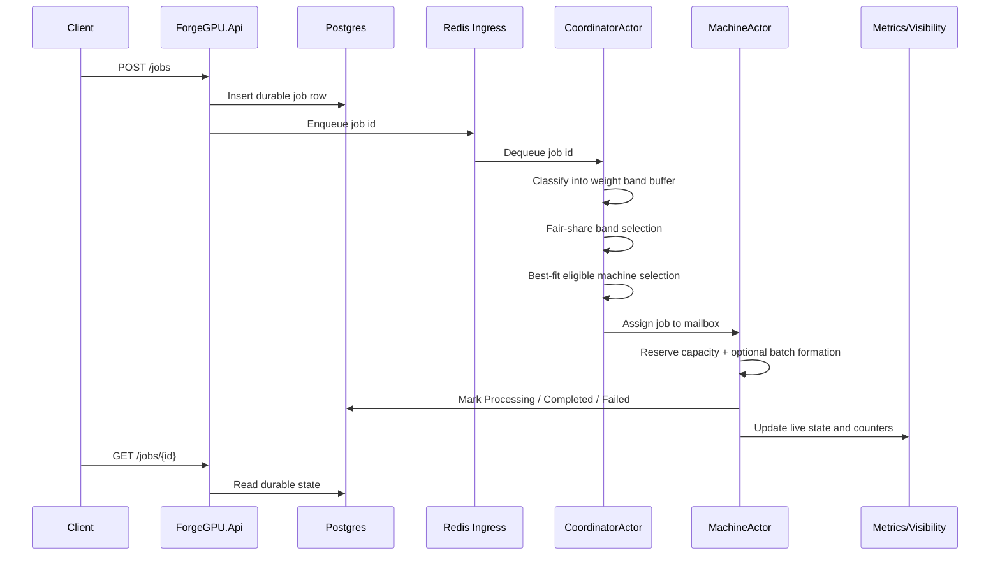
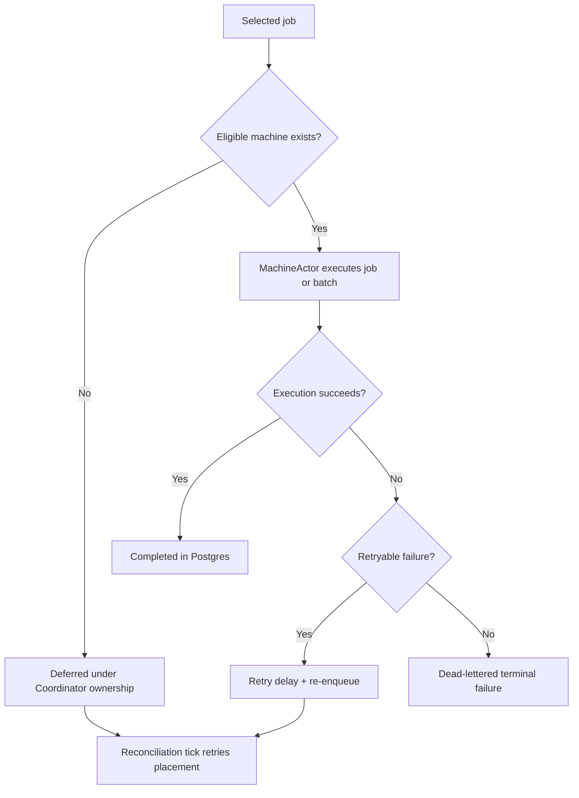

# ForgeGPU

ForgeGPU is a recruiter-facing AI inference orchestration demo built in .NET 10.

It already implements a meaningful vertical slice of an inference control plane:
- durable job state in Postgres
- ingress transport through Redis
- an explicit dispatcher/coordinator flow
- machine-backed execution with actor-oriented ownership
- batching
- observability
- reliability semantics
- repeatable load testing

ForgeGPU is evolving toward a more complete resource-aware scheduling story:
- actor-oriented control plane refinement
- resource-aware fair scheduling
- durable machine catalog plus live state projection
- band-based ingress routing
- planned operator dashboard visibility

The point of the project is not generic background processing. It models the control-plane decisions of an inference platform under resource constraints, fairness requirements, and failure handling.

## Current State vs Target State

| Area | Current state | Target state |
| --- | --- | --- |
| Ingress transport | Redis list ingress with job ids only | Kafka band-topic ingress aligned to coarse weight bands |
| Durable state | Postgres stores durable job state and machine catalog | Postgres remains durable source of truth for jobs, machines, and configuration |
| Orchestration | Coordinator-owned orchestration with internal band buffers | CoordinatorActor remains central control-plane owner with richer fairness and operator tooling |
| Machine model | Heterogeneous fake machines with durable catalog and live Redis projection | Same model, refined with stronger operator surfaces and richer scheduling inputs |
| Scheduling | Resource-aware best-fit machine selection plus internal fair-share pull across bands | Fair-share band scheduling refined further and aligned with Kafka ingress bands |
| Fairness | Internal Deficit Round Robin style scheduling across weight bands | Kafka-aligned band fairness with stronger fairness controls and visibility |
| Batching | Worker-side dynamic batching is implemented | Further tuning and evaluation, without changing control-plane ownership |
| Observability | `GET /metrics`, `GET /workers`, and `GET /machines` expose live state | Planned operator dashboard on top of the same state model |
| Reliability | Timeouts, retries, failure classification, dead-letter state | More durable/recoverable retry orchestration and richer operational history |
| Dashboard | No full UI dashboard yet | Planned operator dashboard for bands, machines, scheduler decisions, and utilization |

## Why ForgeGPU Exists

ForgeGPU exists to demonstrate how an inference platform thinks about scheduling, placement, and execution under constraints.

This is not just a job queue and not just a worker pool. The interesting part is the control plane:
- which job gets attention first
- which machine is eligible
- why one machine is chosen instead of another
- what happens when capacity is unavailable
- how fairness and efficiency are balanced
- how failures, retries, and terminal outcomes remain inspectable

The design aims to balance fairness for customers and efficient resource usage for the platform.

## Core Design Principles

- Postgres is the durable source of truth for durable entities and configuration.
- Redis holds live projections and ingress state, not durable truth.
- Actor-owned in-memory state is the authoritative live execution state.
- Exact weight remains authoritative for scheduling and accounting.
- Coarse bands are for ingress grouping only.
- Workers and machines must not directly consume from future Kafka ingress lanes.
- The Orchestrator / Coordinator sits between ingress and machine execution.
- A central Coordinator owns assignment decisions.
- Machine actors own resource reservations and execution state.
- Exact weight is never discarded even when jobs are grouped into coarse ingress bands.

## System Architecture Overview

```mermaid
flowchart LR
    Client[Client / Caller] --> API[ForgeGPU.Api]
    API --> PG[(Postgres\nDurable Jobs + Machine Catalog)]
    API --> RQ[(Redis\nIngress Queue)]

    RQ --> C[CoordinatorActor / Orchestrator]
    PG --> C
    C --> MB1[MachineActor 01 Mailbox]
    C --> MB2[MachineActor 02 Mailbox]
    C --> MB3[MachineActor N Mailbox]

    MB1 --> M1[MachineActor 01\nLive Resource State]
    MB2 --> M2[MachineActor 02\nLive Resource State]
    MB3 --> MN[MachineActor N\nLive Resource State]

    M1 --> PG
    M2 --> PG
    MN --> PG

    M1 --> RP[(Redis\nLive Machine Projection)]
    M2 --> RP
    MN --> RP

    API --> Obs[/metrics, /workers, /machines]
    PG --> Obs
    RP --> Obs
    C --> Obs
```

What this diagram shows:
- jobs enter through the API
- durable job state is written before execution
- ingress transport is separated from execution ownership
- the coordinator performs scheduling and assignment
- machine actors own live state and execution
- observability is exposed through API surfaces backed by durable and live state

## Communication and Control Flow

### Normal execution flow



### Deferred, retry, and terminal-failure paths



## Actor-Oriented Orchestration

ForgeGPU uses a lightweight actor-inspired design because ownership matters.

This is not a heavyweight external actor framework. The implementation is intentionally simple: channels, mailboxes, owned state, and explicit control flow.

### CoordinatorActor responsibilities

- pull jobs from the ingress path
- classify jobs into internal band buffers
- apply fair-share selection across bands
- inspect machine snapshots and liveness
- choose the best-fit eligible machine
- assign jobs to machine mailboxes
- own deferred-job reconciliation

### MachineActor responsibilities

- own live machine resource state
- reserve and release capacity units
- reserve and release simulated VRAM
- own running-job membership
- execute assigned work
- form worker-side batches when compatible
- publish heartbeat and live projection
- participate in retry, timeout, and failure behavior

Why this helps:
- scheduling remains explainable because one place owns assignment
- machine state remains consistent because one actor owns reservations
- Redis remains projection-only instead of becoming hidden truth
- future transport changes can happen without breaking execution ownership

## Machine Model

ForgeGPU uses fake heterogeneous machines to make resource-aware scheduling explainable.

A capacity unit is a simulated abstract resource budget. It is not real hardware telemetry. It exists to make placement decisions readable and to show how fragmentation, fairness, and saturation interact.

### Current demo machine profiles

| Machine | Capacity Units | CPU Score | RAM MB | GPU VRAM MB | Max Parallel Workers | Supported Models |
| --- | ---: | ---: | ---: | ---: | ---: | --- |
| `machine-01` A100 Heavy Node | 15 | 42 | 32768 | 12288 | 2 | `gpt-sim-a`, `gpt-sim-mix` |
| `machine-02` L4 Throughput Node | 20 | 36 | 49152 | 16384 | 3 | `gpt-sim-b`, `gpt-sim-mix` |
| `machine-03` Balanced Multi-Model Node | 17 | 40 | 65536 | 14336 | 2 | `gpt-sim-a`, `gpt-sim-b`, `gpt-sim-mix` |
| `machine-04` Edge Constraint Node | 5 | 16 | 16384 | 4096 | 1 | `gpt-sim-a` |
| `machine-05` General Purpose Node | 12 | 28 | 24576 | 8192 | 2 | `gpt-sim-b`, `gpt-sim-mix` |

Concrete example:

A 17-unit machine may receive `10w + 5w + 1w + 1w`, instead of only `1w` jobs or only medium jobs, to balance fairness and resource utilization.

## Job Model

Each job keeps both durable execution state and scheduling-relevant metadata.

Key fields include:
- `prompt`
- `model`
- `weight`
- `weightBand`
- `requiredMemoryMb`
- `status`
- `retryCount`
- `maxRetries`
- `lastFailureReason`
- `lastFailureCategory`
- timestamps such as `CreatedAtUtc`, `StartedAtUtc`, `CompletedAtUtc`, `LastAttemptAtUtc`

Why this matters:
- exact weight is preserved and remains authoritative
- `weightBand` is derived and used for ingress grouping
- `requiredMemoryMb` is a resource hint for placement
- retry and failure metadata keep execution inspectable
- durable timestamps make latency and lifecycle observable

## Weight Bands

**ForgeGPU uses coarse resource bands for ingress grouping and exact weight for scheduling decisions.**

ForgeGPU does not create one queue per exact weight. That would create too many ingress lanes, make the transport harder to reason about, and weaken the story around fairness versus placement.

Instead, ForgeGPU groups jobs into coarse bands while preserving exact weight on every job.

| Band name | Weight range | Why it exists |
| --- | --- | --- |
| `W1_2` | `1-2` | Keep very small jobs granular without exploding ingress lanes |
| `W3_5` | `3-5` | Capture small-but-nontrivial work as a separate fairness lane |
| `W6_10` | `6-10` | Represent moderate work without treating every exact value as its own lane |
| `W11_20` | `11-20` | Group heavier jobs that should not be starved behind tiny work |
| `W21_40` | `21-40` | Represent large work classes that need visible fairness treatment |
| `W41Plus` | `41+` | Provide a coarse lane for very heavy jobs without one-topic-per-weight explosion |

Why this model exists:
- bands keep ingress lanes understandable
- exact weight still drives real scheduling and accounting
- later phases can align Kafka ingress to the same bands without discarding precise job cost

## Scheduling Algorithms

### Best-Fit Eligible Machine

ForgeGPU currently performs machine selection by filtering to eligible machines and then choosing the best fit.

Among eligible machines, the system chooses the one that leaves the smallest non-negative remaining capacity after placement. Best-fit machine selection reduces fragmentation and preserves larger machines for heavier work.

Eligibility checks include:
- durable machine enabled state
- live heartbeat/liveness availability
- supported model
- enough remaining capacity units
- enough worker slots
- enough simulated VRAM and related admission constraints

### Deficit Round Robin

ForgeGPU now uses internal band buffers in the coordinator and applies an explainable Deficit Round Robin style pull policy before machine assignment.

Current implementation direction:
- bands accumulate scheduling credit
- a selected job spends credit using its exact weight as the debit amount
- the coordinator rotates across bands fairly rather than draining only the lightest lane first
- after a job is selected fairly, machine assignment still uses best-fit eligible machine logic

This fair scheduling layer is live today over internal band buffers. Kafka-aligned band ingress comes later as a transport change, not as the first fairness step.

## Resource Estimation

Resource estimation stays explicit and deterministic.

The estimator combines:
- exact weight
- required memory
- model family
- simple explainable cost math

The output is an effective cost in capacity units. Weight bands do not replace this math. They only provide ingress grouping. Exact weight and resource hints still drive real placement decisions.

## Liveness, Heartbeat, and Availability

ForgeGPU separates machine truth into three layers:
- Postgres machine catalog: durable machine definitions
- Redis live projection: fast shared runtime view
- MachineActor memory: authoritative live execution ownership

Machine actors publish heartbeats periodically. A stale heartbeat means the machine is unavailable for new assignment.

Liveness states are interpreted as:
- `Live`: heartbeat is current and actor is available
- `Offline`: actor shut down gracefully and projected an offline state
- `Stale`: heartbeat expired and the machine should be treated as unavailable
- `Unavailable`: machine exists durably but is not schedulable because of actor or configuration state

Important distinction:
- actor stop does not mean durable machine deletion
- Redis holds live projections; Postgres holds durable truth

## Deferred, Retry, Dead-Letter, and Fallback Behavior

When placement or execution fails, the job remains inspectable.

1. If no machine is currently eligible, the coordinator defers the job and retries placement later.
2. If execution times out, the job is classified explicitly and retry policy decides whether it is re-enqueued.
3. If execution fails with a retryable error, the job is retried with fixed-delay semantics.
4. If retries are exhausted or failure is non-retryable, the job becomes a terminal dead-lettered record.
5. The job remains visible through durable job state and failure metadata.

Current reliability model is already implemented. It is intentionally simple, explicit, and demo-friendly rather than pretending to be a full production failure orchestration layer.

## Observability and Dashboard Direction

### Visible today

ForgeGPU already exposes live operational visibility through API surfaces:
- `GET /metrics`
- `GET /workers`
- `GET /machines`
- `GET /jobs/{id}`
- `GET /jobs/dead-letter`

These surfaces show:
- queue and deferred depth
- band buffer depth and fair-share credits
- machine utilization and liveness
- worker-style execution view
- batch activity
- retry and dead-letter behavior
- latency summaries

### Planned dashboard

A full operator dashboard is not implemented yet.

The target operator dashboard is expected to show:
- ingress and resource band depths
- machine cards with live utilization
- scheduler decision stream
- fairness summary
- utilization summary
- deferred job visibility

## Load and Performance

ForgeGPU includes `k6` scenarios to demonstrate behavior under concurrent traffic.

Current scenarios:
- `basic`: baseline submit + poll throughput and latency
- `batch`: compatible traffic that demonstrates worker-side batching effectiveness
- `constrained`: capacity pressure that demonstrates deferred behavior and non-placement paths
- `reliability`: mixed success, retry, timeout, and dead-letter behavior under load

These are intended to demonstrate architecture behavior, not just benchmark vanity numbers.

## Example End-to-End Flow

Example job:
- prompt: `generate summary`
- model: `gpt-sim-a`
- weight: `21`
- weight band: `W21_40`
- required memory: `4096 MB`

Possible flow:
1. API writes the durable job row to Postgres.
2. The job id is pushed to Redis ingress.
3. CoordinatorActor classifies it into `W21_40`.
4. The fair-share layer selects that band when it has enough credit.
5. Best-fit machine selection picks a live eligible machine with enough remaining capacity and VRAM.
6. MachineActor reserves resources and may batch it with compatible work.
7. The job completes, retries on a retryable failure, or becomes dead-lettered if retries are exhausted.

## Not in Scope Yet

The following are intentionally not fully implemented yet:
- Kafka ingress migration
- final dashboard UI
- distributed actor runtime or failover
- real GPU telemetry
- adaptive data-driven scheduling
- advanced multi-tenant policy layers
- production-grade durable deferred queue semantics

## Run the System

```bash
cp .env.example .env
./scripts/forgegpu.sh up --build --detach
./scripts/forgegpu.sh health
```

Key endpoints:
- `POST /jobs`
- `GET /jobs/{id}`
- `GET /jobs/dead-letter`
- `GET /metrics`
- `GET /workers`
- `GET /machines`
- `GET /health`

## Example API Calls

Submit a job:

```bash
curl -X POST http://localhost:8080/jobs \
  -H "Content-Type: application/json" \
  -d '{
    "prompt": "run simulation",
    "model": "gpt-sim-b",
    "weight": 21,
    "requiredMemoryMb": 8192
  }'
```

Inspect a job:

```bash
curl http://localhost:8080/jobs/<job-id>
```

Inspect live system state:

```bash
curl http://localhost:8080/metrics
curl http://localhost:8080/workers
curl http://localhost:8080/machines
```

Run load scenarios:

```bash
./scripts/forgegpu.sh load basic --vus 6 --iterations 24
./scripts/forgegpu.sh load batch --vus 8 --iterations 32 --model gpt-sim-a --required-memory 1024
./scripts/forgegpu.sh load constrained --vus 6 --iterations 18 --model gpt-sim-b --required-memory 14000 --poll-timeout-ms 12000
./scripts/forgegpu.sh load reliability --vus 6 --iterations 20 --poll-timeout-ms 90000
```

## Target Architecture Direction

ForgeGPU is moving toward a tighter alignment between ingress grouping, fairness, and machine-aware assignment.

Planned next steps:
- Kafka ingress migration using coarse band topics
- richer fairness controls across ingress bands
- stronger operator dashboard visibility
- continued refinement of actor-oriented ownership and explainable scheduling

The core direction remains stable:
- coarse bands for ingress grouping
- exact weight for scheduling decisions
- central coordinator ownership for assignment
- machine actor ownership for live execution state
