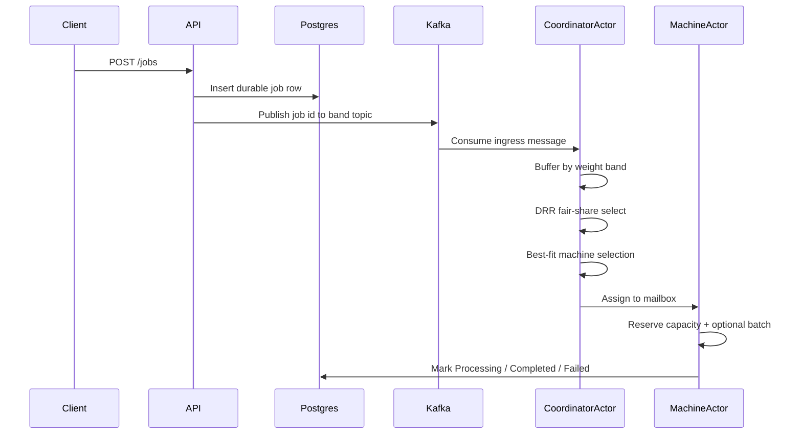
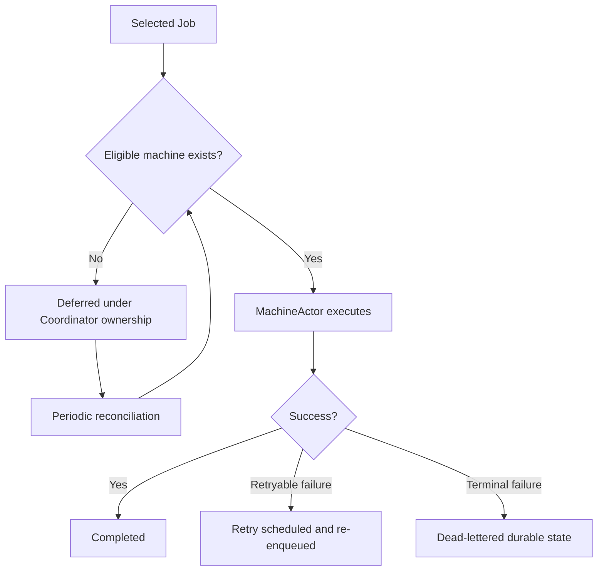

# ForgeGPU

ForgeGPU is a recruiter-facing AI inference orchestration demo built in .NET 10. It models the control plane of an inference platform rather than a generic background-job system: jobs are durably recorded in Postgres, published to Kafka band topics, selected by a coordinator with fair-share logic, assigned to eligible machines using resource-aware best fit, executed by actor-owned machine workers, and exposed through live metrics, a real-time operator dashboard with polling fallback, and repeatable load scenarios.

## Why This Project Is Interesting

ForgeGPU is designed to show systems thinking in a compact codebase.

It demonstrates:
- inference orchestration instead of CRUD-style job handling
- scheduling under resource constraints
- actor-inspired control-plane ownership
- durable truth versus live projection separation
- batching, retry, timeout, and dead-letter behavior
- operational visibility through metrics, machine state, recent events, and a dashboard
- reproducible load scenarios with `k6`

This makes the repository useful in recruiter and engineering conversations because the design choices are explicit and inspectable.

## Current Implementation

Current implemented capabilities:
- durable job state in Postgres
- Kafka-aligned ingress topics by coarse weight band
- `CoordinatorActor` as the scheduling brain
- `MachineActor` as the execution and resource owner
- internal band buffers with DRR-style fair-share scheduling
- exact-weight debit preserved for scheduling
- resource-aware best-fit eligible machine selection
- durable machine catalog in Postgres
- live machine projection in Redis
- heartbeat and liveness handling
- batching, retry, timeout, and dead-letter behavior
- `/metrics`, `/machines`, `/workers`, `/events/recent`
- built-in operator dashboard at `/dashboard/`
- `k6` load scenarios and operational scripting

## Current State vs Target Direction

| Area | Current implementation | Target direction |
| --- | --- | --- |
| Ingress transport | Kafka band topics | Same model with richer fairness controls and visualization |
| Durable truth | Postgres for jobs and machine catalog | Postgres remains durable source of truth |
| Live projection | Redis machine projection | Same projection model with richer operator views |
| Scheduling | DRR-style fair-share across internal band buffers | Continued fairness tuning and stronger operator explanation |
| Placement | Resource-aware best-fit eligible machine | Same placement model with future refinement |
| Execution ownership | MachineActor owns live resource and execution state | Same actor-oriented ownership model |
| Reliability | Retry, timeout, dead-letter implemented | More polish, not a redesign |
| Dashboard | Lightweight built-in operator dashboard | Further polish and storytelling |

## Core Design Ideas

- Postgres holds durable truth.
- Redis holds live projections.
- Kafka is ingress transport only.
- `CoordinatorActor` sits between ingress and execution.
- `MachineActor` owns resource reservations and execution state.
- ForgeGPU uses coarse resource bands for ingress grouping and exact weight for scheduling decisions.
- Exact weight is never discarded even when jobs are grouped into coarse ingress bands.
- Best-fit machine selection reduces fragmentation and preserves larger machines for heavier work.

## Architecture Overview

```mermaid
flowchart LR
    Client[Client] --> API[ForgeGPU.Api]
    API --> PG[(Postgres\nJobs + Machine Catalog)]
    API --> Kafka[(Kafka Band Topics)]

    Kafka --> Coord[CoordinatorActor]
    PG --> Coord

    Coord --> Bufs[Internal Band Buffers\nDRR Fair Share]
    Bufs --> Assign[Best-Fit Eligible Machine Selection]

    Assign --> M1[MachineActor 01]
    Assign --> M2[MachineActor 02]
    Assign --> MN[MachineActor N]

    M1 --> PG
    M2 --> PG
    MN --> PG

    M1 --> Redis[(Redis Live Projection)]
    M2 --> Redis
    MN --> Redis

    API --> Obs[/metrics /machines /workers\n/events/recent /dashboard]
    PG --> Obs
    Redis --> Obs
```

What matters here:
- Kafka does not schedule work.
- The coordinator schedules work.
- Machines do not consume ingress directly.
- Machine actors own live execution state.

## Control Flow

### Normal path



### Deferred and reliability path



## CoordinatorActor vs MachineActor

### CoordinatorActor

Responsibilities:
- consume Kafka ingress
- classify jobs into internal band buffers
- apply DRR-style fair-share selection
- inspect machine liveness and capacity
- choose the best-fit eligible machine
- own deferred-job re-evaluation

### MachineActor

Responsibilities:
- own live machine state
- reserve and release capacity units
- reserve and release simulated VRAM
- own running jobs and mailbox execution
- form compatible batches
- update durable job state
- publish heartbeat and live projection

This ownership model keeps the system explainable. There is one place for global scheduling and one place per machine for live execution state.

## Machine and Resource Model

ForgeGPU uses fake heterogeneous machines to make scheduling decisions understandable.

A capacity unit is a simulated abstract scheduling budget. It is not real GPU telemetry. It exists so scheduling and fragmentation are explainable.

| Machine | Capacity Units | CPU Score | RAM MB | GPU VRAM MB | Max Parallel Workers | Supported Models |
| --- | ---: | ---: | ---: | ---: | ---: | --- |
| `machine-01` A100 Heavy Node | 15 | 42 | 32768 | 12288 | 2 | `gpt-sim-a`, `gpt-sim-mix` |
| `machine-02` L4 Throughput Node | 20 | 36 | 49152 | 16384 | 3 | `gpt-sim-b`, `gpt-sim-mix` |
| `machine-03` Balanced Multi-Model Node | 17 | 40 | 65536 | 14336 | 2 | `gpt-sim-a`, `gpt-sim-b`, `gpt-sim-mix` |
| `machine-04` Edge Constraint Node | 5 | 16 | 16384 | 4096 | 1 | `gpt-sim-a` |
| `machine-05` General Purpose Node | 12 | 28 | 24576 | 8192 | 2 | `gpt-sim-b`, `gpt-sim-mix` |

Example intuition:

A 17-unit machine may receive `10w + 5w + 1w + 1w`, instead of draining only tiny jobs or only medium jobs, to balance fairness and resource utilization.

## Job Model

Each job stores:
- `prompt`
- `model`
- `weight`
- `weightBand`
- `requiredMemoryMb`
- `status`
- retry metadata
- failure metadata
- timestamps for queue wait, execution, and total latency

Important distinctions:
- exact weight is authoritative
- `weightBand` is derived
- `requiredMemoryMb` is a resource hint
- retry/failure fields keep execution inspectable

## Weight Bands and Exact Weight

**ForgeGPU uses coarse resource bands for ingress grouping and exact weight for scheduling decisions.**

Ingress bands:
- `W1_2` -> `forgegpu.jobs.w1_2`
- `W3_5` -> `forgegpu.jobs.w3_5`
- `W6_10` -> `forgegpu.jobs.w6_10`
- `W11_20` -> `forgegpu.jobs.w11_20`
- `W21_40` -> `forgegpu.jobs.w21_40`
- `W41Plus` -> `forgegpu.jobs.w41_plus`

| Band | Range | Purpose |
| --- | --- | --- |
| `W1_2` | `1-2` | keep tiny jobs granular |
| `W3_5` | `3-5` | separate small jobs from trivial ones |
| `W6_10` | `6-10` | represent moderate work cleanly |
| `W11_20` | `11-20` | prevent medium-heavy work from starvation |
| `W21_40` | `21-40` | make large work visible in fairness logic |
| `W41Plus` | `41+` | avoid one-topic-per-weight explosion for heavy jobs |

Why this matters:
- bands keep ingress understandable
- exact weight still drives DRR debit
- exact weight still drives resource estimation and placement
- Kafka lanes align with the taxonomy, but Kafka itself is not the scheduling layer

## Scheduling Algorithms

### Deficit Round Robin

The coordinator maintains internal band buffers and applies a DRR-style fair-share loop.

Behavior:
- each band accumulates credit
- selecting a job spends credit using the job's exact weight
- heavier jobs still get a path to selection
- fairness is applied before machine placement

### Best-Fit Eligible Machine

After DRR selects a job, ForgeGPU filters eligible machines and chooses the one that leaves the smallest non-negative remaining capacity after placement.

That reduces fragmentation and preserves larger machines for heavier work.

## Batching, Reliability, and Observability

### Batching
- worker-side batching only
- compatible jobs share model and fit resource limits
- each job still keeps independent durable lifecycle state

### Reliability
- timeout handling
- retryable versus terminal failure classification
- capped retry policy
- dead-lettered durable state for terminal failures

### Observability
- `GET /metrics`
- `GET /machines`
- `GET /workers`
- `GET /events/recent`
- `GET /jobs/{id}`
- `GET /jobs/dead-letter`
- operator dashboard at `/dashboard/`

## Operator Dashboard

Route:
- `http://localhost:8080/dashboard/`

The dashboard is a read-only operator view over the live orchestration system. It uses SignalR for live push updates where available and retains the existing polling path as a fallback.

Sections:
- queue bands and Kafka ingress
- machine cards
- scheduler decision stream
- fairness and utilization summary
- machine utilization heatmap
- deferred-job visibility

It is intentionally lightweight: HTML, CSS, JS, and a small SignalR hub served by the existing ASP.NET host.

## Benchmark and Behavior Summary

ForgeGPU includes `k6` scenarios that demonstrate system behavior rather than synthetic benchmark marketing.

What the project currently demonstrates under load:
- concurrent job ingestion through Kafka band topics
- fair-share selection across weight bands
- batching under compatible traffic
- deferred behavior under constrained capacity
- retry and dead-letter behavior under induced failures
- machine utilization and scheduler visibility through metrics and dashboard views

Included scenarios:
- `basic`
- `batch`
- `constrained`
- `reliability`

## How to Demo ForgeGPU

Start the stack:

```bash
cp .env.example .env
./scripts/forgegpu.sh up --build --detach
./scripts/forgegpu.sh health
./scripts/forgegpu.sh topics
./scripts/forgegpu.sh dashboard
```

Open the dashboard:

```bash
open http://localhost:8080/dashboard/
```

The dashboard will subscribe to live updates automatically. If SignalR is unavailable, it continues refreshing through the existing HTTP polling path.

Submit mixed-band jobs:

```bash
for w in 2 5 10 20 40 41; do
  curl -s -X POST http://localhost:8080/jobs \
    -H "Content-Type: application/json" \
    -d "{\"prompt\":\"demo-$w\",\"model\":\"gpt-sim-a\",\"requiredMemoryMb\":2048,\"weight\":$w}"
done
```

Trigger a deferred case:

```bash
curl -s -X POST http://localhost:8080/jobs \
  -H "Content-Type: application/json" \
  -d '{"prompt":"demo-deferred","model":"gpt-sim-b","requiredMemoryMb":20000,"weight":41}'
```

Inspect APIs directly if needed:

```bash
curl http://localhost:8080/metrics
curl http://localhost:8080/machines
curl 'http://localhost:8080/events/recent?limit=20'
```

## Script and Runtime Shortcuts

Useful commands:

```bash
./scripts/forgegpu.sh up --build --detach
./scripts/forgegpu.sh health
./scripts/forgegpu.sh topics
./scripts/forgegpu.sh dashboard
./scripts/forgegpu.sh metrics
./scripts/forgegpu.sh workers
./scripts/forgegpu.sh load basic --vus 6 --iterations 24
./scripts/forgegpu.sh down
```

Local runtime note:
- local development uses a ZooKeeper-less Kafka-compatible runtime
- the repository currently uses Redpanda in Docker Compose for simple local Kafka semantics

## CV-Ready Framing

ForgeGPU demonstrates the kind of engineering decisions that matter in platform and inference infrastructure work:
- orchestration under constraints
- actor-inspired control-plane design
- Kafka ingress separated from scheduling logic
- durable truth versus live projection separation
- fair-share scheduling with exact-weight debit
- machine-aware placement
- batching
- reliability semantics
- observability and operator tooling
- load-driven validation

That is the main value of the project: it is small enough to read, but large enough to discuss real control-plane tradeoffs.

## Not in Scope Yet

Not implemented yet:
- distributed actor runtime or failover
- real GPU telemetry
- advanced adaptive scheduling
- multi-tenant policy layers
- historical dashboard analytics
- production-grade durable deferred queue semantics

## Screenshots

The dashboard is structured so screenshots can be added later under a simple `docs/` or `assets/` section without changing the architecture story.
